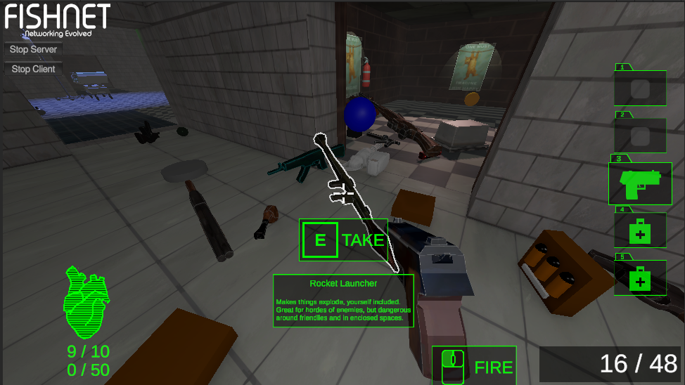
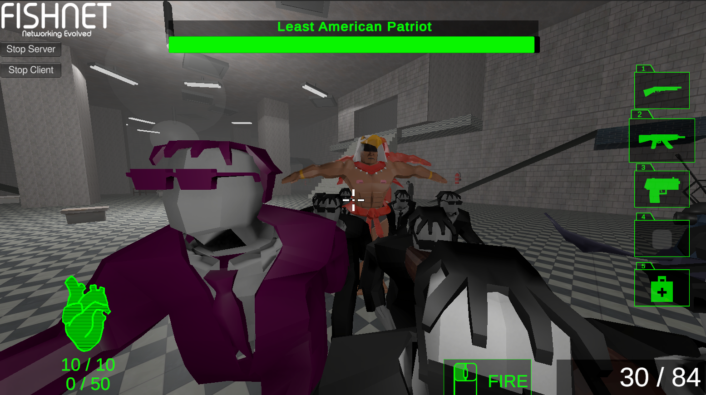
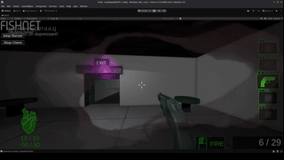
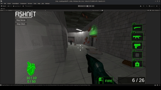
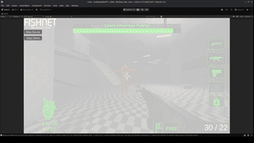

---

**Demo will be available soon... Stay tuned!**

---

I worked on this project as one of the main programmers. The current demo contains 10+ spells, 2 levels, and a battle arena with roguelite progression elements that tests the players' mastery of the weave system.

## My role so far

- Boss implementation with 3 phases and 5 abilities
- Designed exertion and overdose system
- Wall slam mechanism
- UI work
  - progress bar
  - boss health bar
  - drug visual effects
- item hover outline

:::{layout="[[1,1], [1]]" layout-valign="bottom"}

:::
