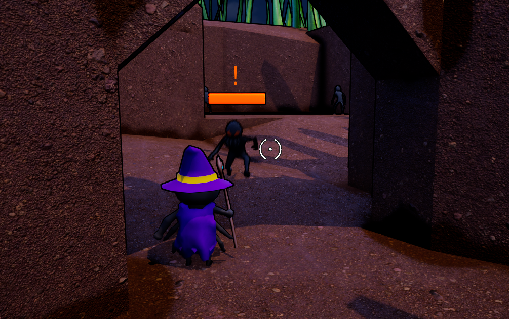
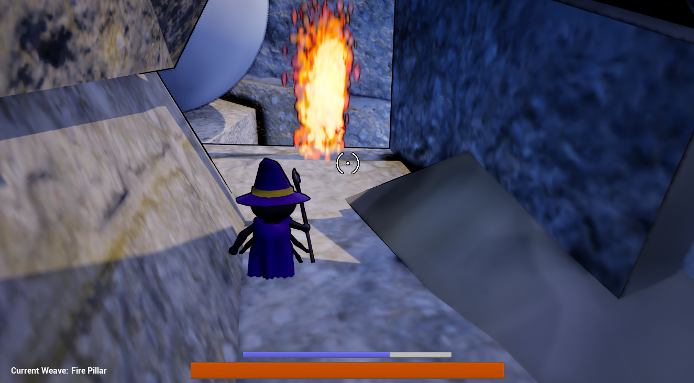
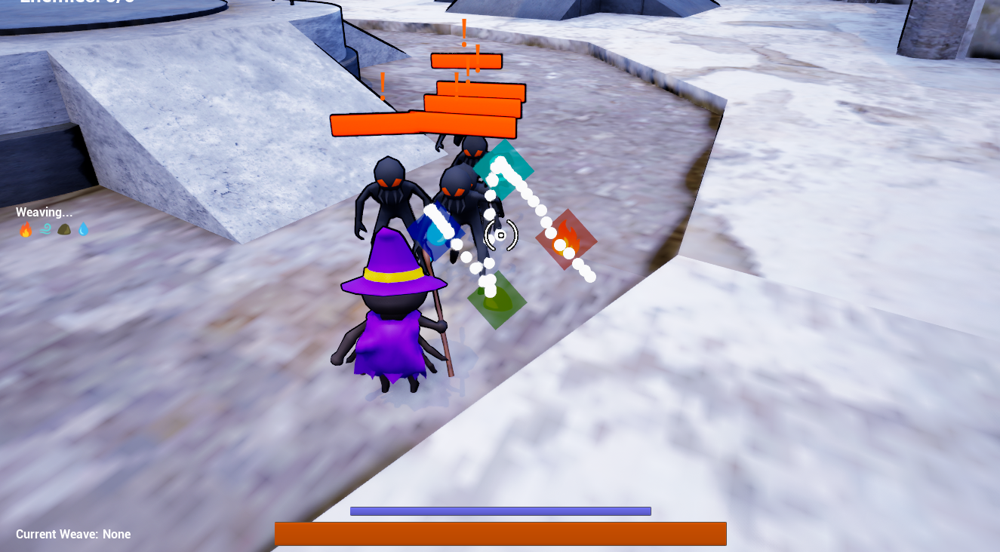
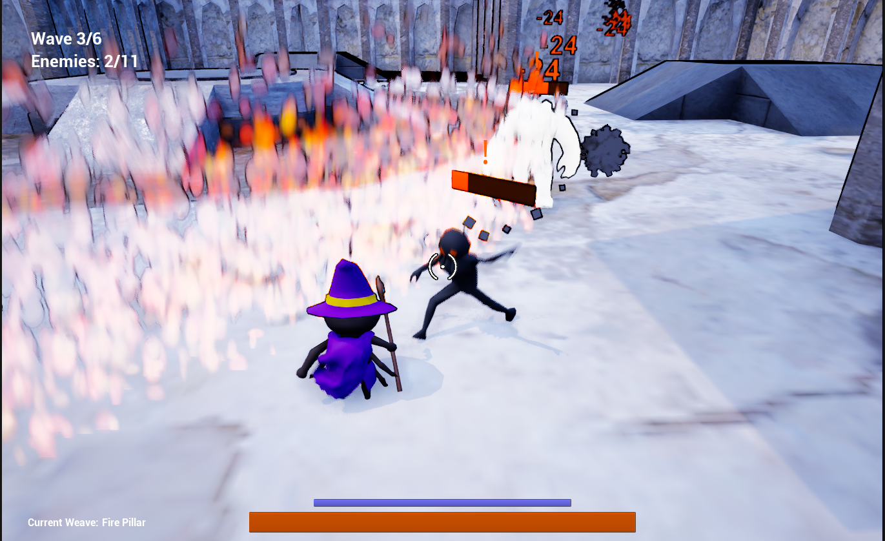
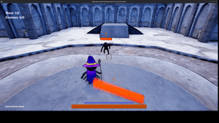
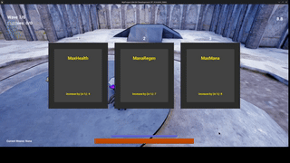

---

**Play the demo through the link below!**

```{=html}
```

[Link to game](https://destroh3.itch.io/prime-weaver)

There will be more development coming soon...

---

I worked on this project as one of the main programmers. The current demo contains 10+ spells, 2 levels, and a battle arena with roguelite progression elements that tests the players' mastery of the weave system.

:::{layout-nrow=2 layout-valign="bottom"}







:::

## My role

- Designed and implemented 3 out of 10 spells
- Implemented permanent stats buff for the arena game mode
- 15+ sfx sourcing and implementation

:::{layout-ncol=2}



:::
